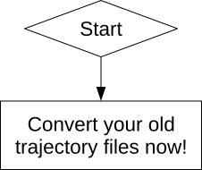

=============================
Atomic Simulation Environment
=============================

The Atomic Simulation Environment (ASE) is a set of tools and Python_
modules for setting up, manipulating, running, visualizing and analyzing
atomistic simulations.  The code is freely available under the :ref:`GNU LGPL
license <license info>`.

.. _Python: http://www.python.org

>>> # Example: structure optimization of hydrogen molecule
>>> from ase import Atoms
>>> from ase.optimize import BFGS
>>> from ase.calculators.nwchem import NWChem
>>> from ase.io import write
>>> h2 = Atoms('H2',
...            positions=[[0, 0, 0],
...                       [0, 0, 0.7]])
>>> h2.calc = NWChem(xc='PBE')
>>> opt = BFGS(h2)
>>> opt.run(fmax=0.02)
BFGS:   0  19:10:49    -31.435229     2.2691
BFGS:   1  19:10:50    -31.490773     0.3740
BFGS:   2  19:10:50    -31.492791     0.0630
BFGS:   3  19:10:51    -31.492848     0.0023
>>> write('H2.xyz', h2)
>>> h2.get_potential_energy()
-31.492847800329216

Supported :mod:`Calculators <ase.calculators>`:

|abinit| |Asap| |Atomistica| |CASTEP| |CP2K| |deMon| |dftb|
|elk| |exciting| |EMT|
|fhi-aims| |fleur| |gpaw| |gromacs| 
|hotbit| |jacapo| |jdftx| |lammps| |nwchem|
|octopus| |onetep| |siesta| |turbomole| |vasp|
:mod:`~ase.calculators.amber`
:mod:`DMol³ <ase.calculators.dmol>`
Gaussian_ Grimme-D3_ :mod:`~ase.calculators.gulp` Mopac_
:mod:`~ase.calculators.tip3p`

Please go through this check-list to figure out if you need to convert your
old ASE trajectory files to the modern file-format:

See how to identify and convert old trajectory files here: :ref:`convert`.

.. _news:

News
====

* Bugfix release: :ref:`ASE version 3.14.1 <releasenotes>` (28 June 2017).

* :ref:`ASE version 3.14.0 <releasenotes>` released (20 June 2017).

* :ref:`Reference paper <cite>` in
  J. Phys. Condens. Matter:
  `The Atomic Simulation Environment | A Python library for working with
  atoms <https://doi.org/10.1088/1361-648X/aa680e>`__
  (7 June 2017).

* :ref:`ASE version 3.13.0 <releasenotes>` released (7 February 2017).

* Psi-k *Scientific Highlight Of The Month*:
  `The Atomic Simulation Environment | A Python library for working with
  atoms <http://psi-k.net/download/highlights/Highlight_134.pdf>`__
  (20 January 2017).

* :ref:`ASE version 3.12.0 <releasenotes>` released (24 October 2016).

* :ref:`ASE version 3.11.0 <releasenotes>` released (10 May 2016).

* :ref:`ASE version 3.10.0 <releasenotes>` released (17 March 2016).

* Web-page now uses the `Read the Docs Sphinx Theme
  <https://github.com/snide/sphinx_rtd_theme>`_ (20 February 2016).

* The source code is now on https://gitlab.com/ase/ase (18 September 2015).

* :ref:`ASE version 3.9.1 <releasenotes>` released (21 Juli 2015).

* :ref:`ASE version 3.9.0 <releasenotes>` released (28 May 2015).

* :ref:`ASE version 3.8.0 <releasenotes>` released (22 October 2013).

* :ref:`ASE version 3.7.0 <releasenotes>` released (13 May 2013).

* :ref:`ASE version 3.6.0 <releasenotes>` released (24 February 2012).

* Bugfix release: :ref:`ASE version 3.5.1 <releasenotes>` (24 May 2011).

* :ref:`ASE version 3.5.0 <releasenotes>` released (13 April 2011).

* :ref:`ASE version 3.4.1 <download_and_install>` released (11 August 2010).

* :ref:`ASE version 3.4 <download_and_install>` released (23 April 2010).

* :ref:`ASE version 3.3 <download_and_install>` released (11 January 2010).

* :ref:`ASE version 3.2 <download_and_install>` released (4 September 2009).

* ASE has reached revision 1000 (16 July 2009).

* :ref:`ASE version 3.1.0 <download_and_install>` released (27 March 2009).

* Improved :mod:`ase.vibrations` module: More accurate and
  possibility to calculate :ref:`infrared` (13
  March 2009).

* :ref:`ASE version 3.0.0 <download_and_install>` released (13 November 2008).

* Asap_ version 3.0.2 released (15 October 2008).

* An experimental abinit interface released (9 June 2008).

* Thursday April 24 will be ASE documentation-day.  Ten people from
  CAMd/Cinf will do a "doc-sprint" from 9 to 16.  (17 Apr 2008)

* The new ASE-3.0 Sphinx_ page is now up and running!  (2 Apr 2008)

* A beta version of the new ASE-3.0 will be used for the
  electronic structure course at CAMd_.  (10 Jan 2008)

Contents
========

.. toctree::

    about
    install
    tutorials/tutorials
    ase/ase
    cmdline
    tips
    gallery/gallery
    releasenotes
    contact
    development/development
    faq

.. |Asap| image:: static/asap.png
   :target: http://wiki.fysik.dtu.dk/asap
   :align: middle

.. |elk| image:: static/elk.png
   :target: http://elk.sourceforge.net/
   :align: middle
.. |EMT| image:: static/emt.png
   :target: ase/calculators/emt.html
   :align: middle
.. |exciting| image:: static/exciting.png
   :target: ase/calculators/exciting.html
   :align: middle
.. |dftb| image:: static/dftb.png
   :target: ase/calculators/dftb.html
   :align: middle
.. |fhi-aims| image:: static/fhi-aims.png
   :target: ase/calculators/FHI-aims.html
   :align: middle
.. |fleur| image:: static/fleur.png
   :target: ase/calculators/fleur.html
   :align: middle
.. |gpaw| image:: static/gpaw.png
   :target: http://wiki.fysik.dtu.dk/gpaw
   :align: middle
.. |gromacs| image:: static/gromacs.png
   :target: http://www.gromacs.org/
   :align: middle
.. |hotbit| image:: static/hotbit.png
   :target: https://trac.cc.jyu.fi/projects/hotbit
   :align: middle
.. |jacapo| image:: static/jacapo.png
   :target: ase/calculators/jacapo.html
   :align: middle
.. |jdftx| image:: static/jdftx.png
   :target: http://sourceforge.net/p/jdftx/wiki/ASE%20Interface
   :align: middle
.. |lammps| image:: static/lammps.png
   :target: ase/calculators/lammps.html
   :align: middle
.. |nwchem| image:: static/nwchem.png
   :target: ase/calculators/nwchem.html
   :align: middle

.. |siesta| image:: static/siesta.png
   :target: ase/calculators/siesta.html
   :align: middle
.. |turbomole| image:: static/tm_logo_l.png
   :target: ase/calculators/turbomole.html
   :align: middle
.. |vasp| image:: static/vasp.png
   :target: ase/calculators/vasp.html
   :align: middle

.. _Gaussian: http://www.gaussian.com/
.. _Mopac: http://openmopac.net/
.. _Grimme-D3: https://gitlab.com/ehermes/ased3/tree/master
.. _Sphinx: http://sphinx.pocoo.org
.. _Asap: http://wiki.fysik.dtu.dk/asap
.. _CAMd: http://www.camd.dtu.dk
